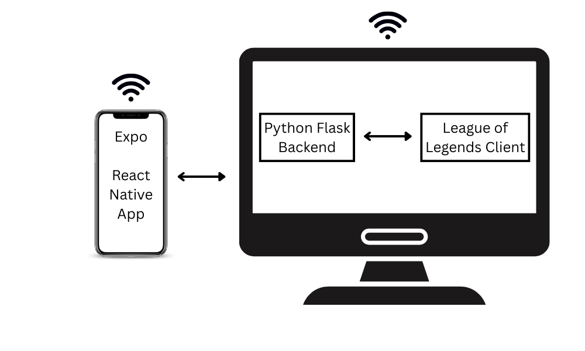

LolRemote

LolRemote lets you queue up for League of Legends remotely using your phone. Get notified when a match is found and accept it instantly - no need to stay by your PC. By using computer vision, LolRemote recognizes events and handles queue states, thus offering you the freedom to do other things while waiting for long queue times. Mobile app built with React Native (Expo), backend with Python - Flask, computer vision implemented with opencv2.

Schematics

Pre-Requisites:

Internet connection
Computer and Mobile Phone that support the following software:
League of Legends: https://www.leagueoflegends.com/ro-ro/download/
Expo: https://expo.dev/ as well as on the mobile device
Flask: https://flask.palletsprojects.com/en/stable/

Setup and Build:

1. Connect to the same network on your Computer and phone.
2. Edit the IP in the "config.js" settings file, located in /Accepter

Running:

1. Run the Flask server on your Computer.
2. Run the Expo App on your Computer.
3. Scan the QR code using Expo Mobile App.
4. Login to League of Legends and choose desired gamemode.
5. You are all set up! Use your phone from here on.
