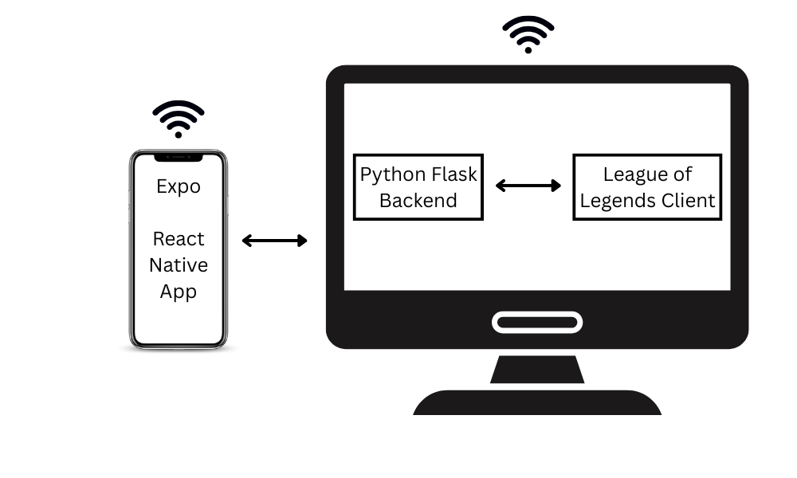

LolRemote

LolRemote lets you queue up for League of Legends remotely using your phone. Get notified when a match is found and accept it instantly - no need to stay by your PC. LolRemote offers you the freedom to do other things while waiting for long queue times. Mobile app built with React Native, backend with Python - Flask.

##Architecture Diagram

